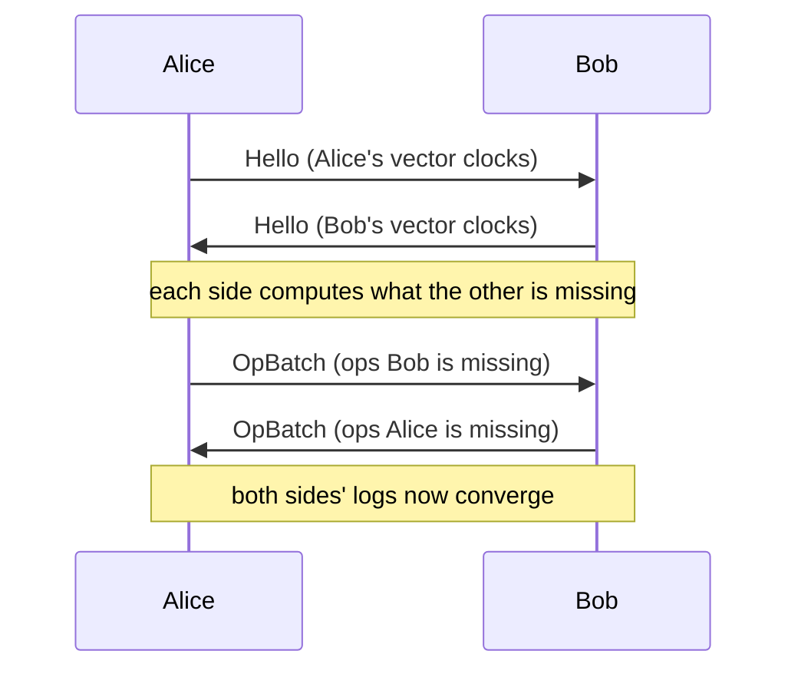

# ethrive

## A Peer-to-Peer Protocol for Sovereign Spaces

---

### Abstract

ethrive is a peer-to-peer protocol in which every participant — a person, a device, a group, a treasury, a program — is identified by a public key and owns a signed, append-only log of operations called a _space_. Spaces are the only persistent primitive. A user is a one-member space; a chat group is a multi-member space; a DAO is a space whose members jointly sign with threshold cryptography; an application stores its data inside a space the user controls. Replication happens directly between members through a vector-clock diff. There is no global ledger, no consensus protocol, no central authority, and no server. Every feature beyond membership and governance — chat, files, collaborative documents, RPC, profiles, settings, on-chain signing — plugs in through a single extension point called a _handler_. The result is a substrate on which applications can be built that are offline-tolerant by construction, user-sovereign by default, and composable across categories that earlier systems treat as unrelated problems.

---

### 1. Introduction: The Sovereignty Problem

For three decades, the architectures available for building networked software have forced an uncomfortable trade-off between sovereignty and capability. The centralised cloud, where most of our messages, documents, payments, and identities live, is overwhelmingly capable. It is also overwhelmingly non-sovereign: the data exists on a server owned by someone else, governed by their terms of service, vulnerable to their bankruptcy, their security incidents, their changes of strategy, and their compliance with whichever jurisdiction they happen to operate within. Every major collaboration tool in production today is one acquihire away from migration toil and one outage away from no service at all.

Public blockchains were the first serious attempt to invert this. By replicating state across a network of self-interested validators, they produced a system where no one operator could censor a transaction or unilaterally seize an account. But the cost of that property has been severe. Every operation pays gas. Every state change is broadcast to and stored by every full node on Earth. The shape of computation is constrained to what a deterministic virtual machine can verify. Privacy is the exception, not the default. And — crucially for applications that involve any kind of mutable, collaborative, evolving state — the model assumes that one global ordered ledger is the right answer to every coordination problem. For a treasury that needs to sign a transfer once a quarter, this is true. For a kanban board updated by three colleagues at the same time, it is absurd.

Earlier peer-to-peer systems — Matrix, Scuttlebutt, IPFS, dat — recognised that the sovereignty problem could be addressed without a global ledger. Each of them contributed a piece: federated identity, append-only logs, content addressing, distributed hash tables. But each treated the various shapes of collaboration as separate problems requiring separate protocols. Identity, groups, file sync, messaging, organisational structure, and application data were all designed independently, often with incompatible assumptions about trust, replication, and offline behaviour. Building a working application on top required stitching together half a dozen specifications, none of which quite agreed about who was authoritative for what. And when participants went offline, things tended to break in ways that were hard to debug and harder to explain to users.

The pattern across all three failures is that data ends up somewhere the user does not control, or the system breaks the moment a participant goes offline, or every new feature requires a new protocol. ethrive is an attempt to do better on all three axes at once, and to do so with a protocol simple enough that an implementer can hold it in their head.

The rest of this paper describes how. Section 2 introduces the single primitive that the whole protocol is built from. Section 3 explains how peers stay in sync without a server. Section 4 describes the three modes of authority, including the threshold-signing scheme that lets a group act as a single on-chain account. Section 5 introduces the handler — the one and only extension point. Section 6 describes how applications are integrated without giving them captive control of user data. Section 7 walks through five concrete things that become possible. Sections 8 through 11 cover plugability, comparisons, open questions, and an invitation to build.

---

### 2. The Core Insight: A Space Is a Signed Log

The whole of ethrive is built from one primitive. A _space_ is a signed, append-only log of operations, owned and replicated by a set of members. Everything else — identity, group membership, organisational structure, application data, on-chain accounts, third-party app installations — is a particular shape of space.

A _principal_ is anything addressable by a public key. A principal with one member, namely itself, is what we colloquially call a _user_. A principal with several members is what we colloquially call a _group_, _team_, _organisation_, _treasury_, or _DAO_, depending on the social context. Members and spaces are the same kind of thing; a one-member space and a multi-member space differ only in their cardinality and in the rules that govern who can sign on the space's behalf. There is no special ontology for users. A user is a space of size one.

This observation collapses categories that earlier systems treat as different problems. In ethrive, a person's identity is a space. The pair-wise relationship that exists between two contacts is a space, automatically created when they first pair. A working group inside a company is a space. The company itself is a space whose members are the working groups, which are themselves spaces. A multi-signature wallet is a space. A third-party application's container of user data is a space. A user's set of devices is a space. Each of these has historically been the subject of a dedicated protocol or product category. ethrive treats them as instances of one shape, and the same machinery — signing, replication, sync, membership, governance, revocation — applies uniformly.

Every mutation to a space is one _operation_: a small JSON object, canonicalised so that its byte representation is uniquely determined, signed by the author with their private key, and appended to the space's log. Three fields do most of the work. The _author_ field carries the public key that signed the operation. The _Lamport counter_ is a per-author monotonic integer, always strictly greater than any value the author has previously observed in the space. The _operation identifier_ is the pair of author and Lamport, which is globally unique by construction. A category-and-kind pair identifies what flavour of operation this is — a chat message, a file manifest, a database write, a governance proposal, and so on — and routes the payload to a handler that knows how to interpret it. The signature anchors the whole thing.

The op is the atom. The log is the molecule. The space is everything.

This minimalism is the protocol's most consequential design decision. By having a single shape for all persistent state, ethrive can supply a single sync protocol, a single security model, a single permission model, a single extension point, and a single set of conformance vectors. An implementer who has correctly written the code that handles one category of operation has substantially completed the work of handling all of them. Two implementations in different programming languages, on different storage backends, over different transports, can interoperate transparently because the wire format underneath them is byte-identical. The protocol is a contract about ops on logs; everything else is local choice.

The cost of this minimalism is that several conveniences a developer might expect — server-side filtering, push notifications by topic, server-issued unique IDs, server-arbitrated conflict resolution — are simply not part of the protocol. They have to be reconstructed in terms of ops on logs, or they have to be admitted to be features of a particular deployment rather than properties of the protocol itself. In practice this trade has gone well: an implementer can describe ethrive's wire format on a single page, and the absence of magic in the protocol means there are no hidden incompatibilities to discover at scale.

---

### 3. How Spaces Stay In Sync

If the wire format is op logs replicated between members, and there is no server to consult for the canonical state, how do two peers actually converge?

The answer is a vector-clock diff. Each peer maintains, for every space it is a member of, a _vector clock_ — a small map that records, for each author who has ever written to the space, the highest Lamport value the peer has seen from that author. When two peers connect — over WebRTC, WebSocket, Bluetooth, a local socket, or any other transport — the first frame each sends is a _Hello_, carrying its vector clock for every shared space. Each peer subtracts: "you have ops from Alice up through Lamport 42 and from Bob up through Lamport 37; I have through 50 and 37 respectively; you are missing Alice's ops 43 through 50." Each peer then ships the missing ops in a batch, ordered by Lamport. The receiver verifies each signature, checks that the author is on the space's roster, appends to the local log if not already present (the operation identifier makes the append idempotent), and dispatches the op to the handler responsible for its category. Both peers have now converged.

This is the entire sync protocol. Every feature ethrive supports — chat, files, RPC, on-chain signing, governance — rides on it. There is no polling, no "is there anything new" loop, no assumed time source, no authoritative replica. Causality is established cryptographically: an op authored by Alice with Lamport 50 was, by the rule by which Alice picks her Lamport values, written after Alice had already seen every op with Lamport ≤ 49 from herself. Causality between ops by different authors is a partial order, not a total one — Alice and Bob can write concurrently — and the protocol does not pretend otherwise. When a total order is required for some specific purpose, handlers tie-break with the operation identifier; the result is deterministic, but the protocol is honest about which orderings are real and which are conventional.

Eventual consistency follows by construction. If two peers have ever exchanged ops, and if no further ops are written, they will converge to identical state. There is no probabilistic finality, no chain reorganisation, no split-brain to recover from. Two peers either have the same set of ops in their logs or they do not, and a single sync exchange resolves the difference.

The model also gives ethrive a property that earlier peer-to-peer systems struggled with: store-and-forward across offline participants. A space is _reachable_ whenever any one of its members is online. If Alice is offline but Bob and Carol are both online and members of the same space, a message Alice sends will eventually reach the space's other members — when Alice next comes online, she syncs with Bob or Carol and her ops propagate onward. There is no inbox owned by a server that might be the wrong inbox or the unavailable inbox. The space's log is the inbox, replicated to every member.

This single property — that a space is a mailbox replicated to its members — is what makes peer-to-peer messaging actually viable for ordinary use. Earlier systems either lost messages when the recipient was offline (true peer-to-peer with no relay) or required an always-online relay run by someone whose trust assumptions had to be carefully managed (federation). ethrive's relays are just the other members of the space, which is to say people the user already trusts to be in the conversation.

---

### 4. Three Modes of Authority

Members always sign their own operations under their own keypairs. But some operations have to be signed under the _space's_ identity rather than under any individual member's: changing the membership of a space, broadcasting an Ethereum transaction from a treasury, attesting to a governance decision the group has made. Who is authorised to sign as the space depends on the space's _mode_.

In _Solo mode_, the space has one member and that member holds the space's keypair. A user's primary space — the space that represents their identity and holds their personal data — is the canonical example. The member is the space; the space is the member; nothing complicated happens.

In _Master-Signer mode_, a multi-member space designates one of its members as the holder of the space keypair. That member can sign on the space's behalf — to add or remove other members, to update the space's metadata, to perform any space-scoped action. The other members can still author their own operations under their own keypairs (chat messages, file uploads, database writes) but cannot sign as the space. This mode is appropriate for groups with a clear leader: a teacher's classroom, a project manager's team, a curator's reading group. The risk is concentrated in one device; the loss of that device is the loss of the space's signing capability and requires migration to another mode or recreation of the space.

In _Threshold mode_, the space's keypair is generated through a ceremony called Distributed Key Generation, after which no single member holds the full private key. Each member holds only a _share_ of it. Producing a signature requires a quorum of members — say, 3 of 5, or 2 of 3 — to participate in a multi-round protocol that ends with a single valid signature under the space's public key, indistinguishable from a signature produced by a hypothetical key-holder who never existed. The protocol used is FROST (Flexible Round-Optimized Schnorr Threshold Signatures, RFC 9591), and ethrive supports both Ed25519 and secp256k1 ciphersuites. The latter is significant: a FROST signature under secp256k1 is byte-for-byte an Ethereum signature. A space in Threshold mode is, on-chain, an ordinary externally-owned account.

The implication is large enough to deserve a moment's pause. A multi-signature Ethereum wallet is conventionally implemented as a smart contract: the contract holds the assets, and each transaction requires a number of independent signatures from authorised keys which the contract verifies on-chain. This works, but it is expensive (every operation pays gas to a verification contract) and observable (the on-chain footprint reveals that this is a multi-sig and may reveal who its members are). A FROST-signing space is a regular externally-owned account from on-chain perspective: it costs a regular transaction's gas, it has no special on-chain code, and the multi-sig nature of its governance is invisible to the chain entirely. The threshold ceremony happens off-chain, between members, over the ordinary peer-to-peer transport. The chain sees only a single signed transaction.

Threshold mode also enables _social recovery_ without trusted intermediaries. The space can be configured with a dormant _guardian_ — typically another space, perhaps representing a hardware wallet held in cold storage or an institutional custodian. In normal operation the guardian is inactive. If too many members of the space lose their shares (a phone is stolen, a laptop is corrupted, a user dies), the remaining members and the guardian can co-operate, after a timelock, to re-establish a quorum and rotate to fresh shares. Any individual member retains a unilateral veto during the timelock window, which prevents the guardian-plus-attacker scenario from succeeding silently.

The cost of Threshold mode is the DKG ceremony, which requires every participant to be online for one bounded interaction, and the per-signature ceremony, which similarly requires a quorum to be online and exchange a small number of messages. For a treasury that signs occasionally this is trivial. For a system that signs constantly it might not be appropriate. Solo and Master-Signer mode remain available for cases where threshold is overkill. The point is that the protocol provides all three under one roof, and the choice is local to each space.

---

### 5. The Extension Point: Handlers

The protocol described in the previous three sections — principals, signed op logs, vector-clock sync, three signing modes — is essentially complete. It contains no chat. It contains no file transfer. It contains no collaborative documents. It contains no on-chain signing. It contains no notion of a profile, a setting, a database row, or an application install. What it contains is the machinery on which all of those features are _built_, by a single extension mechanism: the _handler_.

A handler is a small piece of code that claims one or more operation categories — for example, the chat handler claims the `chat` category, the file handler claims the `file` category — and tells the runtime what to do when an op of that category arrives. The runtime calls `applyOp(operation)` and the handler updates a local materialised store: a list of messages, a content-addressed file index, a key-value table, a CRDT data structure, whatever the feature requires. The runtime guarantees that the handler is called once per op, in a deterministic order, after signature verification has succeeded and the author has been confirmed to be on the roster. Two peers running the same handler over the same set of ops compute the same materialised state. That is the entire contract.

A handler may also claim one or more _RPC method_ names, allowing other peers to invoke functions over a live connection. A presence handler might claim the method `presence.heartbeat`. A sensor handler on a device might claim `sensor.temperature`. The handler can also author its own operations and make its own RPC calls, using a context object the runtime supplies. Calls have a hop budget and carry a cycle set, so recursion is bounded and circular invocations fail fast.

The chat handler, the file handler, the profile handler, the settings handler, the database handler, the CRDT handler, the RPC directory, the EVM handler that performs Ethereum transactions, the application integration handler that manages third-party app installs, the governance handlers that drive Threshold mode, the social-recovery handler that operates dormant guardians — all of these are handlers. None of them is privileged. The protocol's core protocol, the part that must be implemented identically by every conformant runtime, contains membership and governance and sync; everything else is an addition.

Two consequences follow from this design. The first is that new features do not require protocol versions. A new handler can be specified, implemented, and deployed without bumping anything in the core. Two peers that have installed the same new handler can use the new feature together. Two peers that have not both installed it cannot — but the sync protocol still runs between them, and ops of the unknown category are persisted in the log even though they are not projected into any materialised state. When the missing handler is later installed, it replays the stored ops from the log and reconstructs state from history. A peer that joins the network late is in the same position as a peer that has always been there.

The second consequence is that handlers can be substituted. A reference chat handler ships with the runtime, but nothing prevents an alternative chat handler from claiming the same operation category and projecting it differently — perhaps with end-to-end encryption added, perhaps with richer metadata, perhaps optimised for a different storage backend. Because the wire format of the operations is unchanged, a peer running the alternative handler interoperates with peers running the reference handler. The handler is the implementation; the operation is the specification. This separation is what makes the protocol an ecosystem rather than a product.

The handler model does ask app authors to make one decision they cannot avoid: when state is shared between multiple writers, which handler should hold it? The two reasonable choices are the database handler, which resolves concurrent writes by a deterministic last-writer-wins rule, and the CRDT handler, which preserves concurrent writes through type-specific merge. The two handlers are appropriate for different shapes of data. Single-owner records (a user's settings, a profile field, a row keyed by the writer's identity) belong in the database, where last-writer-wins is the correct semantics and concurrent writes are an indication of a bug. Truly shared state — a kanban card whose title two collaborators might rename simultaneously, a counter incremented from multiple devices, a document edited by several authors — belongs in a CRDT, where both writes are preserved and the application can either display the conflict or accept the deterministic merge. Picking the wrong handler does not produce an error; it produces silent data loss, which is the kind of bug that surfaces months later when a user reports that an edit "vanished." The protocol is opinionated about this distinction because the cost of getting it wrong is severe.

---

### 6. Apps Without Captivity

Almost every consumer software product of the past two decades has been built on a model where the user grants the application essentially unrestricted access to a corner of cloud infrastructure that the application also owns. The user's notes live on the notes app's servers. The user's photos live on the photo app's servers. Switching apps means exporting the data — assuming an export is offered at all, in a format that is useful — and importing it into a competitor that may or may not exist. When the original vendor is acquired, pivots, or shuts down, the user's data is at risk in proportion to the vendor's competence and charity.

ethrive's application model is different by construction. An application is a _principal_ with its own keypair, distinct from any user. When a user installs an application, they sign a _delegation certificate_ that enumerates exactly which scopes the application is permitted to exercise: read the user's display name, write to a particular application-owned sub-space, propose Ethereum transactions for the user's review, and so on. The certificate is time-limited. The application carries the certificate and presents it with every operation it authors. Every peer that receives those operations verifies the certificate locally — there is no authorisation server to consult — and rejects ops whose claimed scopes are not in the cert.

Revocation is itself an operation. When the user uninstalls the application or reduces its scopes, a revocation op propagates through ordinary sync. Every peer that has seen it rejects subsequent ops from the application. There is no phone-home and no central authorisation server to cooperate with the revocation. A user who is offline can revoke, and the revocation will propagate when the user next syncs. An application that is offline will eventually learn of its revocation the next time it tries to act.

Critically, the application's data lives in a sub-space that the user owns. If the application's vendor goes bankrupt tomorrow, the user's data is unaffected: it was never on the vendor's servers in the first place. The user can install a different application — one that understands the same data shape — and resume working. The data layer is shared between competing applications; the application is a renderer and a UI, not a data silo.

The implications of this for the application ecosystem are worth dwelling on. Vendor lock-in, in the strong sense of the user's data being held by a particular vendor, is structurally not possible. Two applications with similar feature sets compete on quality, not on accumulated user data. A user who is unhappy with an application can switch in minutes without data loss. A new entrant in a category is not handicapped by the incumbent's data moat. Open-source and commercial applications can read and write the same user-owned data, allowing users to mix proprietary editors with open-source viewers, or to gradually migrate between them. None of this requires standardisation by an industry body; it requires only that applications share a handler shape, which is something the protocol can enforce technically.

This model also handles a category of applications that conventional architectures struggle with: applications shared by a group. A team installs a kanban app, and all members of the team write to a single shared container under the team's space. Each member's install authenticates as itself (each install is its own principal with its own keypair) and writes are attributed to the install that authored them. Per-install revocation lets the team remove one member's access without disturbing the others'. When the data is genuinely shared between members — the kanban cards themselves, the document being co-edited, the counter being co-incremented — the CRDT handler ensures that concurrent writes are preserved.

---

### 7. A Gallery of What Becomes Possible

Several of the building blocks described in earlier sections are familiar from prior systems in isolation. What ethrive makes possible is the _combination_: peer-to-peer sync that survives offline, threshold signing that produces ordinary on-chain transactions, scoped delegation that does not require an authorisation server, all under one protocol with one extension point. This section walks through five concrete applications. None of them are speculative; each is built directly from the primitives in earlier sections.

**The chat that survives offline.** Alice and Bob each run an ethrive runtime — on their phones, their laptops, in a browser tab. They pair once, through a one-shot ceremony in which each side displays a four-digit PIN and both sides confirm the match. From that pairing, ethrive automatically creates a two-member space — their pair space. Alice writes a message; her runtime appends a chat operation to the pair space's log and signs it with her key. Bob is on a train with no signal; nothing reaches him. When Bob's phone reconnects from the next station, it talks to Alice's phone (over WebRTC, having found her through one of the discovery mechanisms), exchanges vector clocks, fetches the missing ops, and delivers them to Bob's chat handler. Bob sees the message. Crucially, Alice's message was never held on a server — it lived only on Alice's devices and now Bob's. There was no inbox to lose, because the space's log is the inbox.

**The kanban board with three editors.** Alice, Bob, and Carol form a team space and install a kanban application that has been built to support shared containers. The team space has three members, each with their own install of the kanban app. All three installs write to a shared sub-space owned by the team. Alice and Bob are both in the office; Carol is on a flight. Alice and Bob both decide to rename the "Login" card to "Sign-in" within a few seconds of each other; neither sees the other's edit before authoring their own. Carol concurrently adds a tag to the same card. When all three reconnect, the protocol's behaviour depends entirely on which handler the kanban app chose for its data. If the database handler — last-writer-wins — was used, exactly one rename survives in materialised state and the other is silently discarded; Carol's tag may or may not be lost depending on timing. If the CRDT handler was used, both renames survive in a multi-value register and Carol's tag is applied; the application's UI can show the conflict and let a member resolve it. The same operations were authored in both cases. The data model determined what was lost and what was kept. Choosing the right handler is the most consequential decision an application author makes, and the protocol is opinionated that getting it right means CRDT for concurrent shared writes.

**The DAO that signs Ethereum transactions.** Five members form a space in Threshold mode with a 3-of-5 quorum, performing a one-time DKG ceremony that gives each member a share of a secp256k1 keypair. The space's public key is, on Ethereum, an ordinary externally-owned account; a deposit address can be printed on a receipt or engraved on a coin. When the DAO wants to send funds, a member proposes an Ethereum transaction by authoring a proposal op. The other members review the proposal in their respective application UIs and either approve or reject by authoring their own ops. When three approvals have been gathered, three of the members run a brief multi-round FROST signing ceremony over the live peer connections. The output is a single secp256k1 signature, valid for the proposed transaction, under the space's public key. Any member can broadcast the signed transaction to the Ethereum network, which sees nothing unusual — no multi-sig contract, no on-chain governance ceremony, just a signed transaction from a regular account. No member ever held the full key. No custodian ever held shares. No on-chain bytes were spent on governance verification. The treasury cost is one transaction's gas.

**The notes app that survives its vendor.** Alice installs a notes application from vendor V. The app's manifest declares it as a single-user application requesting two scopes: write access to the notes container under Alice's primary space, and read access to her display name. Alice approves both during installation. The app receives a delegation certificate good for thirty days, which the runtime renews automatically as long as Alice keeps the app installed. Alice uses the app for six months, during which her notes accumulate in her own space. Vendor V is acquired and the new owner shuts down the product. The application's servers go dark. Alice's notes do not move; they were never on the vendor's servers. Alice installs a different notes application from vendor W, which understands the same data shape, grants it the same scopes, and within ten minutes is working with all of her old notes — same data, different vendor, zero data loss. The competitive landscape this enables is one in which applications compete on user experience and quality, not on accumulated data lock-in.

**The family treasury with a hardware-wallet guardian.** A family of four wants a shared cryptocurrency reserve for emergencies and long-term savings. They form a 3-of-4 Threshold space. They also add a dormant guardian: a hardware wallet held in a safe deposit box, configured as a one-member space whose key is on the device. In normal operation any three family members can co-sign a withdrawal. The hardware wallet is never touched. If one or two members lose their shares — a phone is stolen and wiped, a laptop is corrupted — withdrawals continue to work; the family is below the recovery threshold but above the signing threshold. If a third member's share is lost, the family is below quorum and cannot sign. They retrieve the hardware wallet from the safe deposit box, the runtime initiates a recovery ceremony, and after a 24-hour timelock window during which any remaining family member could veto, the guardian and any one surviving member can together rotate to fresh shares and re-establish quorum. The hardware wallet is then returned to the safe. Custody is distributed; recovery is possible; no third party has been involved at any step.

These five vignettes are not exhaustive. The same primitives support collaborative documents, federated social networks, multi-device synchronisation of personal data, organisational structures composed of nested groups, on-chain identity tied to off-chain reputation, and many other shapes. The point of the gallery is that each of these applications is built from the same machinery — a space, a log of signed ops, vector-clock sync, mode-appropriate signing, scoped delegation, the right handler for the data shape. There is no separate DAO protocol, no separate messaging protocol, no separate file-sync protocol, no separate identity protocol. There is one protocol, and these are five of the things it can be used to build.

---

### 8. Plugability All the Way Down

The protocol described above is abstract in one further direction that has not yet been explicit: every concrete substrate it relies on is itself pluggable. A conformant ethrive implementation must agree about the wire format — the canonicalisation of operations, the signing scheme they verify against, the framing of sync messages — but it gets to choose its own implementation of every other component.

The signing scheme can be Ed25519 (small keys, fast verification, appropriate for software identities) or secp256k1 (Ethereum-compatible, appropriate for on-chain interop) or a custom signer wrapping a hardware token. Verification is dispatched on the signature length; two ciphersuites can coexist within one space. The transport can be WebRTC for browser-to-browser, WebSocket for browser-to-server, Bluetooth Low Energy for nearby devices, an in-process channel for tests, or anything else that can move bytes bidirectionally. The op-log store can be a file system with one operation per file, an SQLite database, a Postgres cluster, an embedded RocksDB, the browser's Origin Private File System, or anything else that can persist and retrieve byte sequences in order. The blob store, used by the file handler, similarly admits a filesystem, an S3 bucket, an IPFS gateway, or any backend that can store content-addressed bytes. The identity vault, which protects private key material, can be a file encrypted with a passphrase, the operating system's keychain, a hardware security module, or a hardware wallet. Discovery — how peers find each other for the first time after pairing or after disconnection — can be multicast DNS for local networks, a distributed hash table for global rendezvous, a lightweight relay room for NAT traversal, a QR code displayed in person, or a Bluetooth advertisement.

Two peers running entirely different stacks — say, a browser tab using WebRTC and the OPFS storage backend, talking to a data-centre process using WebSocket and a Postgres backend — interoperate transparently because the bytes that cross between them are the bytes the protocol specifies. There is no privileged reference implementation. The protocol is a contract about what peers say to each other, not a product that peers run.

This stance has consequences. There is no canonical ethrive client that competitors must reverse-engineer. There is no foundation that controls a privileged implementation. There is no upgrade path that must be coordinated centrally. A new implementation in a new language, on a new substrate, is a first-class participant from day one if it passes the conformance vectors that ship with the specification.

---

### 9. Comparisons

It is worth being explicit about where ethrive sits relative to the prior systems it draws on or competes with.

**Versus the centralised cloud.** Where Slack, Notion, Drive, and their kin store user data on servers they own and operate, ethrive stores user data in spaces the users own. The cloud's advantages — search across a corpus, ranking, inference, multi-region availability, unbounded storage — are real, and an ethrive deployment can choose to provide those services through optional always-online peers acting as augmentations rather than authorities. But the data does not leave the user's control to receive those services. A cloud provider that goes bankrupt takes the service down; an augmenting peer that goes offline merely makes the service slower until a different augmenting peer is reachable.

**Versus public blockchains.** Ethrive does not maintain a global ordered ledger. It does not require validators or miners. It does not have a token. It does not have gas. It does not pretend that every transition needs to be visible to every participant in the network. What it shares with public chains is the conviction that cryptographic signing, replicated state, and verifiable causality are the right tools for building systems that do not require trust in a central party. What it adds is the recognition that most useful shared state is not global — it is per-space, per-group, per-relationship — and that protocols which start from that observation can be radically simpler. Ethrive interoperates with chains where that interoperation is useful: Threshold mode produces ordinary on-chain signatures, and the EVM handler coordinates the lifecycle of an on-chain transaction from intent through signing through broadcast through confirmation tracking. Chains and ethrive are complementary, not substitutes.

**Versus prior peer-to-peer systems.** Matrix, Scuttlebutt, dat, IPFS, and others contributed important pieces — federated identity, append-only logs, content addressing, distributed hash tables. The respect ethrive owes to these systems is large. Where it differs is in unifying the various shapes of collaboration under one primitive, which substantially reduces the surface area an implementer must master and the assumptions an application author must reconcile. The unification also enables features that are awkward in the prior systems: scoped delegation to applications, threshold signing for treasuries, social recovery, and a single extension point through which all of them are added. The cost is that an application author moving from a pure event log or a pure CRDT system has to learn ethrive's choices about which abstraction applies where.

The point of these comparisons is not to dismiss the alternatives. Each of them is appropriate for some applications. The point is that ethrive occupies a specific position on the map: peer-to-peer rather than client-server, per-space rather than global-ledger, single primitive rather than multiple specifications, with explicit support for treasuries, applications, and offline collaboration baked into the protocol rather than left as an exercise.

---

### 10. Open Questions and Future Work

The protocol described in this paper is complete in the sense that two implementations can produce a working system. It is not complete in the sense that all interesting questions have been answered. Several remain.

_Bootstrap discovery_ — how a fresh peer with no contacts finds the first peer to pair with — is supported by several mechanisms (mDNS, DHT, relay rooms, QR, Bluetooth) but the trade-offs between them in different deployment environments are still being characterised.

_Handler version negotiation_ — how two peers discover whether they are running the same version of a given handler, and what to do when they disagree — is currently handled by the convention that handlers ignore unknown sub-fields and version their schema additively. A more principled mechanism may be appropriate as the handler ecosystem grows.

_Scaling to very large spaces_ — direct membership scales to perhaps the hundreds of members, beyond which the storage and bandwidth costs of full replication to every member become prohibitive. Larger groups are typically expressed by composing smaller spaces (a guild of teams, each team being its own space). Whether a sub-quadratic sync protocol for very large flat spaces is worth specifying remains open.

_Privacy of metadata across relays_ — when a member of a space relays operations on behalf of offline members, the relay learns something about the patterns of activity in the space, even if the op payloads are encrypted. Mitigations exist (cover traffic, mixnets, selective relay) but a coherent default policy is still under discussion.

_Quantum-readiness_ — both Ed25519 and secp256k1 are vulnerable to attack by a sufficiently large quantum computer. The protocol's modular signature dispatch makes the addition of post-quantum signing schemes mechanically straightforward, but the operational question of when and how to migrate existing spaces to new ciphersuites is still being worked through.

It is also worth being explicit about what is _out of scope by design_. There is no global ledger. There are no gas fees. There is no token. There is no validator economy. There is no on-chain governance baked into the protocol — governance is per-space, by the space's members, under the rules they choose. There are no NFT primitives in the core; the protocol is content-agnostic, and applications that want to represent ownership of digital artefacts do so through ordinary handlers and, where appropriate, through the EVM bridge. The protocol's restraint about what to bake in is not oversight; it is an attempt to keep the core small enough to reason about, and to keep the responsibility for application semantics where it belongs, in the application.

---

### 11. Conclusion

The argument of this paper has been simple. There is one primitive: a space, which is a signed append-only log of operations replicated between its members. There are three modes of authority: solo, master-signer, and threshold. There is one extension point: the handler, which claims operation categories and projects them into materialised state. From these three pieces — one primitive, three modes, one extension point — a peer-to-peer protocol can be assembled that supports identity, groups, organisations, treasuries, collaborative applications, third-party app installs, on-chain signing, and offline-tolerant communication, all within a uniform machinery that an implementer can hold in their head.

The trade-off ethrive makes is to refuse the convenience of a central authority, in exchange for a substrate on which user data sovereignty, vendor portability, offline resilience, and composable authority are the default behaviours rather than features that applications must work to provide. The cost of refusing central authority is that some things ethrive cannot do (or can do only through optional cooperating peers): global search across all data, authoritative ordering of unrelated events, server-side filtering and notification at scale. The benefit is that users own their data in a sense that is not just legal but technical, that applications compete on quality rather than accumulated data, that treasuries do not require trusted custodians, and that systems do not break when participants go offline.

The protocol is open. The specification is complete. The wire format is byte-identical across implementations. There is no privileged client, no foundation that owns a reference, no permission needed to participate. An implementer in any language who passes the conformance vectors is, by construction, a first-class participant in the network.

For those who want the full normative specification, it lives alongside this paper in the `specs/` directory: `PRIMER.md` for the fifteen-minute orientation, `CORE.md` for the complete protocol, `ARCHITECTURE.md` for the static shape of one runtime, `SYNC.md` for the dynamic behaviour across multiple peers, the modules under `modules/` for each handler, and `EXAMPLES.md` for thirteen worked end-to-end scenarios. For those who would rather build than read, it is sufficient to know that the wire format is signed JSON operations, that the sync protocol is a vector-clock diff, and that your first handler is one short class implementing two methods.

Welcome aboard.

---

### Glossary

A compact selection of terms used in this paper. Full definitions for every term in the protocol live in `specs/GLOSSARY.md`.

**Principal** — anything addressable by a public key (a member, a space, an application install, a device).

**Member** — a one-member space; colloquially, a user's identity.

**Space** — a signed, append-only log of operations, replicated by its members. The only persistent primitive in the protocol.

**Primary space** — a member's personal space; identity and personal data store in one.

**Operation (op)** — one signed mutation to a space; the unit of replication.

**Op log** — the complete ordered history of operations for one space.

**Lamport counter** — a per-author monotonic integer; supports causal ordering without timestamps.

**Vector clock** — per-space map of author to maximum-Lamport-seen; drives the sync diff.

**Handler** — the protocol's single extension point; claims operation categories and RPC methods, projects them into materialised state.

**Mode** — one of three signing policies for a space (Solo, Master-Signer, Threshold).

**FROST** — Flexible Round-Optimized Schnorr Threshold Signatures (RFC 9591); the basis of Threshold mode. Allows t-of-n members to jointly produce a signature without any one member holding the full private key.

**DKG** — Distributed Key Generation; the one-time ceremony that gives each member of a Threshold space a share of the space's keypair.

**Delegation certificate** — a signed grant of scoped, time-limited rights from one principal (typically a user) to another (typically an application).

**Scope** — an atomic permission string listed in a delegation certificate; granted per-scope, not all-or-nothing.

**CRDT** — Conflict-free Replicated Data Type; the handler family that preserves concurrent writes through type-specific merge.

**LWW** — last-writer-wins; the resolution rule the database handler uses for single-owner records.

**Pair space** — the two-member space created automatically when two principals pair.

**Invite code** — the one-shot rendezvous artefact used during pairing.
